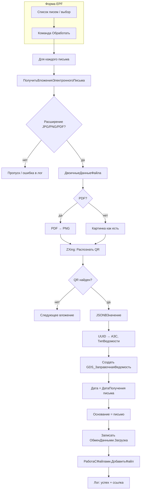

# Phase 4: Архитектура

## Постановка

Внешняя обработка `ЗагрузкаЗаправочныхВедомостей`: ручной выбор входящих писем → вложение (JPG/PNG/PDF) → QR → создание непроведённой `GDS_ЗаправочнаяВедомость` → прикрепление файла → связь через реквизит письма.

## Сложность

Сложная (см. phase0).

## Подход

**Прагматичный:** EPF с серверной логикой в модуле объекта; переиспользование БСП (`УправлениеЭлектроннойПочтой`, `РаботаСФайлами`, `ОбщегоНазначения.JSONВЗначение`); внешняя компонента для QR-decode; минимальные правки CF — только те, что пользователь добавляет сам.

## QR: встроенные возможности и выбор

| Вариант | Описание | Вердикт |
|---------|----------|---------|
| `УправлениеПечатью.ДанныеQRКода` / `ГенерацияШтрихкода` | Только **генерация** QR | ❌ decode |
| `РаспознаваниеДокументовSDK.СоздатьЗаданиеРаспознаванияПоQRКоду` | Облако; на входе **готовая строка** QR | ❌ |
| Сканер ШК (`уатОбщегоНазначения`) | Аппаратный сканер | ❌ |
| **Утилита ZXing (gozxing) в макете EPF** | `QRCodeRecognizer.exe` в `КомпонентаQR` (BinaryData), вызов через `ЗапуститьПриложение` | ✅ **реализовано** |
| PDF → PNG (ImageMagick) + ZXing | Для PDF: растр первой страницы, затем decode | ✅ для PDF |

**Реализация:** бинарник `QRCodeRecognizer.exe` (порт [gozxing](https://github.com/makiuchi-d/gozxing), ~3 МБ) хранится в макете `КомпонентаQR` обработки. При первом вызове извлекается во временный каталог сервера 1С. Пересборка: `tools/qrcoderecognizer` (`go build -o QRCodeRecognizer.exe`), затем копия в `Templates/КомпонентаQR/Ext/Template.bin`.

Для PDF: временный файл → вызов ImageMagick (`magick convert -density 200 ...`) если доступен на сервере 1С, иначе сообщение пользователю «PDF: установите ImageMagick» (в конфигурации уже есть настройки ImageMagick для сканирования).

## Поток данных



## Метаданные CF (добавляет пользователь)

1. **Исправить** `Catalog.GDS_ЗаправочнаяВедомостьПрисоединенныеФайлы.Attribute.ВладелецФайла`:
   - Было: `DocumentRef.ЭлектронноеПисьмоВходящее`
   - Нужно: `DocumentRef.GDS_ЗаправочнаяВедомость`

2. **Реквизит связи с письмом** на документе `GDS_ЗаправочнаяВедомость` (добавлен пользователем):
   - **`Основание`** : `ДокументСсылка.ЭлектронноеПисьмоВходящее` — **согласованное имя** (не `ЭлектронноеПисьмо`, см. решение после ревью)
   - Проверка заполнения: не проверять

3. **Опционально** (для формы документа): вывести реквизит `Основание` и команду «Присоединённые файлы» (`CommonCommand.ПрисоединенныеФайлы`) — по аналогии с `GDS_АктЗавозаВывозаТехВоды`.

4. **Опционально:** макет внешней компоненты ZXing в CF (`ОбщийМакет`) — если не хранить в EPF.

## Структура EPF

```
src/epf/ЗагрузкаЗаправочныхВедомостей/
├── ЗагрузкаЗаправочныхВедомостей.xml
└── ЗагрузкаЗаправочныхВедомостей/
    ├── Ext/ObjectModule.bsl          — серверная логика
    └── Forms/Форма/
        ├── Ext/Form.xml              — таблица писем, лог, кнопки
        └── Ext/Form/Module.bsl       — клиент + вызовы сервера
```

### Форма EPF

| Элемент | Назначение |
|---------|------------|
| Таблица `Письма` | Динамический список / таблица значений: ссылка, тема, дата, отправитель, статус обработки |
| Команда «Заполнить» | Загрузить все `ЭлектронноеПисьмоВходящее` (без отбора) |
| Команда «Обработать» | Обработать отмеченные / все строки |
| Таблица `Результат` | Письмо, вложение, ведомость, текст ошибки |

### Модуль объекта EPF — ключевые функции

| Функция | Назначение |
|---------|------------|
| `ПолучитьСписокПисем()` | Запрос всех входящих писем |
| `ОбработатьПисьмо(Письмо)` | Оркестратор |
| `НайтиQRВоВложениях(Письмо)` | Перебор вложений JPG/PNG/PDF |
| `РаспознатьQRИзДвоичныхДанных(ДД, Расширение)` | PDF→PNG + ZXing |
| `РазобратьДанныеQR(СтрокаQR)` | JSON → структура |
| `СоздатьВедомостьПоДаннымQR(ДанныеQR, Письмо, ДДВложения, ИмяФайла)` | Создание документа + файл |
| `ТипВедомостиПоСтроке(Строка)` | Маппинг перечисления |

### Декодирование QR (после распознавания)

```bsl
Данные = ОбщегоНазначения.JSONВЗначение(QRСтрока);
АЗС = Справочники.уатАЗС.ПолучитьСсылку(Новый УникальныйИдентификатор(Данные.АЗС));
// Контрагент — игнорируем
ТипВедомости = ТипВедомостиПоСтроке(Данные.ТипВедомости);
```

### Создание документа

```bsl
ДокументОбъект = Документы.GDS_ЗаправочнаяВедомость.СоздатьДокумент();
ДокументОбъект.Дата = Письмо.ДатаПолучения; // или Дата документа письма
ДокументОбъект.АЗС = АЗС;
ДокументОбъект.ТипВедомости = ТипВедомости;
ДокументОбъект.Основание = Письмо;
ДокументОбъект.ОбменДанными.Загрузка = Истина;
ДокументОбъект.Записать();
```

### Прикрепление файла

```bsl
ПараметрыФайла = РаботаСФайлами.ПараметрыДобавленияФайла();
ПараметрыФайла.ВладелецФайлов = ДокументОбъект.Ссылка;
ПараметрыФайла.ИмяБезРасширения = ...;
ПараметрыФайла.РасширениеБезТочки = ...;
Адрес = ПоместитьВоВременноеХранилище(ДвоичныеДанныеВложения);
РаботаСФайлами.ДобавитьФайл(ПараметрыФайла, Адрес, , ИмяФайла);
```

## Этапы реализации

- [x] **Этап 1: Метаданные CF (пользователь)**
  - Исправить `ВладелецФайла` в `GDS_ЗаправочнаяВедомостьПрисоединенныеФайлы`
  - Реквизит `Основание` на документ (связь с письмом)
  - **Критерии:** типы корректны; конфигурация загружается в ИБ
  - **Зависимости:** блокирует этапы 3–4

- [x] **Этап 2: Компонента QR + каркас EPF**
  - Подключение ZXing (макет в EPF или CF)
  - Модуль `РаспознатьQRИзДвоичныхДанных` + обработка PDF
  - **Файлы:** `ObjectModule.bsl`, при необходимости макет компоненты
  - **Критерии:** на тестовом PNG с QR возвращается JSON-строка

- [x] **Этап 3: Серверная логика обработки**
  - `ОбработатьПисьмо`, создание документа, `ДобавитьФайл`
  - **Файлы:** `ObjectModule.bsl`
  - **Критерии:** из письма с валидным вложением создаётся непроведённая ведомость с файлом и заполненным `Основание`

- [x] **Этап 4: Форма EPF**
  - Список писем, команды, лог результатов
  - **Файлы:** `Form.xml`, `Form/Module.bsl`
  - **Критерии:** пользователь выбирает письма, запускает обработку, видит результат

- [x] **Этап 5: Сборка и проверка**
  - `epf-build`, syntaxcheck, ручной тест на ИБ
  - **Критерии:** EPF открывается; сценарий end-to-end на тестовом письме

## Риски

| Риск | Митигация |
|------|-----------|
| Нет ZXing на сервере | Инструкция по установке компоненты; проверка при открытии формы |
| PDF без ImageMagick | Явное сообщение; JPG/PNG работают |
| ГСМ обязателен | `ОбменДанными.Загрузка` |
| Неверный `ВладелецФайла` | Пользователь исправляет до этапа 3 |
| Большой объём писем | Предупреждение на форме; обработка пакетами по выделенным строкам |

## Исправления после ревью (phase 7)

| # | Проблема | Статус |
|---|----------|--------|
| 1 | Бинарник ZXing в макете | ✅ `QRCodeRecognizer.exe` в `КомпонентаQR/Ext/Template.bin` |
| 2 | Утечка temp-файлов PDF | ✅ удаление на успешном пути |
| 3 | Проверка АЗС | ✅ `ОбщегоНазначения.СсылкаСуществует` |
| 4 | `Основание` vs `ЭлектронноеПисьмо` | ✅ оставлено **`Основание`** (решение пользователя) |
| 5 | Транзакция документ + файл | ✅ `НачатьТранзакцию` / откат |
| 6 | Дубликаты ведомостей | ✅ запрос по `Основание` перед созданием |
| 7 | ImageMagick из настроек | ✅ `РаботаСФайлами.ПолучитьНастройкиСканированияПользователя` |
| 8 | Method chaining в запросе | ✅ разбито |
| 9 | Предупреждение о всех письмах | ✅ надпись на форме |

## Технический долг (осознанный)

- Нет регистрации в БСП ДОиО
- Нет регламентного задания
- Контрагент из QR не сохраняется
- Утилита ZXing — только Windows x64 (сервер 1С)
