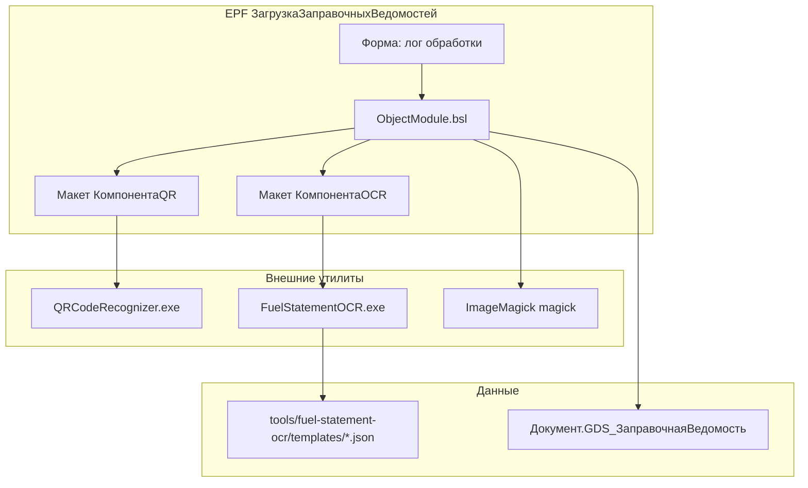
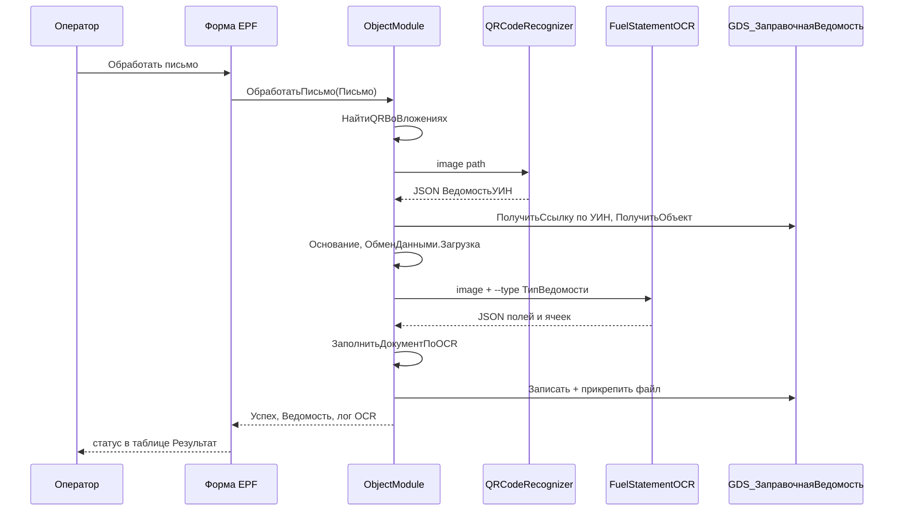

# Phase 4: Архитектура OCR рукописных цифр на сканах заправочных ведомостей

## 1. Постановка и сложность

### Цель

Дополнить EPF `ЗагрузкаЗаправочныхВедомостей` распознаванием **рукописных цифр** в ячейках-гребёнках на сканах трёх типов ведомостей. QR остаётся обязательным каналом идентификации документа; OCR заполняет количественные поля существующего `GDS_ЗаправочнаяВедомость`.

### Вход / выход

| Вход | Выход |
|------|-------|
| Вложение письма (JPG/PNG/PDF) | Заполненные реквизиты документа и строк ТЧ `Заправки` |
| QR → `ВедомостьУИН` | Прикреплённый файл скана (как сейчас) |
| `ТипВедомости` документа (из метаданных, не из QR) | Частичная запись при ошибках + `Комментарий` и лог EPF |

### Ограничения v1

- Только **цифры** в гребёнках (не текст, не подписи, не госномера).
- Три эталонных бланка: `scans/ведомости.{1,2,3}.jpg`.
- Внешняя утилита **Go + OpenCV**, template matching по образцу `1234567890` на бланке.
- **Минимальные правки CF** — вся логика в EPF + `tools/fuel-statement-ocr/`.
- Формат QR **не меняем** (только `ВедомостьУИН`).

### Оценка сложности

| Фактор | Уровень | Комментарий |
|--------|---------|-------------|
| Интеграция с EPF | Низкий | Паттерн `КомпонентаQR` уже есть |
| Go-утилита (OpenCV) | Средний | Новая разработка, но узкий домен (10 цифр) |
| Калибровка масок × 3 бланка | Высокий | Разная вёрстка, наклон скана, синяя ручка |
| Маппинг в 1С | Средний | Часть колонок бланка не имеет прямого реквизита |
| Надёжность OCR | Высокий | Рукопись, качество сканов, пустые ячейки |

**Итог:** задача **средне-высокой** сложности; критический путь — калибровка масок и устойчивость template matching, не BSL-интеграция.

### Принятые архитектурные решения

| Решение | Обоснование |
|---------|-------------|
| OCR **после** QR, **до** `Записать()` | Пользователь; документ и тип уже известны |
| Тип маски из `Документ.ТипВедомости` | Не зависим от формата QR; enum уже в метаданных |
| Нормализованные координаты + якоря | Масштаб и небольшой наклон скана |
| Эталон `1234567890` **с того же скана** | Адаптация к почерку конкретного заполнения |
| Частичная запись + аудит в `Комментарий` | Пользователь; не блокировать весь документ |
| Поля без реквизита → только лог OCR v1 | Минимальные правки CF; расширение метаданных — отдельная задача |

---

## 2. Архитектура

### Обнаруженные паттерны кодовой базы

- **Внешняя утилита:** макет → temp exe → `ФайловаяСистема.ЗапуститьПрограмму` → UTF-8 stdout → JSON (`ObjectModule.bsl`, строки 264–330).
- **PDF:** ImageMagick `magick -density 200` (`ПреобразоватьPDFВPNG`, строки 332–378).
- **Документ:** `ОбменДанными.Загрузка = Истина`, непроведённый, поиск по УИН (`ВедомостьПоДаннымQR`, строки 194–228).
- **Форма EPF:** лог результатов в таблице `Результат`, проверка компоненты при открытии (`Form/Module.bsl`).

### Компоненты


```text
Diagram: Components (graph TB)
  [Форма] --> [ObjectModule]
  [ObjectModule] --> [КомпонентаQR] --> QRCodeRecognizer.exe
  [ObjectModule] --> [КомпонентаOCR] --> FuelStatementOCR.exe
  [ObjectModule] --> ImageMagick
  FuelStatementOCR.exe --> templates/*.json
  [ObjectModule] --> GDS_ЗаправочнаяВедомость
```

### Поток данных


```text
Diagram: Data flow (sequence)
  Operator -> Form : Обработать
  Form -> ObjectModule : ОбработатьПисьмо
  ObjectModule -> QR util : image
  QR util -> ObjectModule : ВедомостьУИН
  ObjectModule -> Document : ПолучитьОбъект
  ObjectModule -> OCR util : image + type
  OCR util -> ObjectModule : JSON cells
  ObjectModule -> Document : fill + Записать + file
  ObjectModule -> Form : result + OCR log
```

### Рефакторинг точки вставки в EPF

Текущий `ВедомостьПоДаннымQR` сразу вызывает `Записать()`. Для OCR нужно **разделить**:

1. `ПолучитьДокументПоУИН(УИН)` — ссылка + объект.
2. `ПодготовитьДокументКЗагрузке(Объект, Письмо)` — `Основание`, `ОбменДанными.Загрузка`.
3. `РаспознатьИЗаполнитьOCR(Объект, ДвоичныеДанные, Расширение)` — вызов утилиты, маппинг.
4. `СохранитьВедомостьСВложением(Объект, ДвоичныеДанные, ИмяФайла)` — транзакция: `Записать()` + `ПрикрепитьФайлКВедомости`.

OCR вставляется между шагами 2 и 4. `Дата` из OCR **перекрывает** текущую подстановку `ДатаПолучения` письма, если день/месяц распознаны.

### Go-утилита `FuelStatementOCR`

```
tools/fuel-statement-ocr/
  cmd/fuel-statement-ocr/main.go    # CLI
  internal/
    preprocess/                     # grayscale, deskew, blue-channel extraction
    anchor/                         # QR + reference strip detection
    template/                       # digit templates from 1234567890
    recognize/                      # per-cell matching
    template/                       # load JSON masks
  templates/
    zapravka.json                   # Заправочная (.3.jpg)
    prihodnaya.json                 # Приходная (.2.jpg)
    perelivnaya.json                # Переливная (.1.jpg)
  go.mod
  Makefile / build.ps1              # windows/amd64 → exe для макета
```

**CLI:**

```text
FuelStatementOCR.exe <image-path> --type <zapravka|prihodnaya|perelivnaya> [--templates <dir>]
```

- Код возврата `0` — JSON в stdout (даже при частичном распознавании).
- Код возврата `≠ 0` — фатальная ошибка (файл не читается, неизвестный тип, не найдены якоря).
- `--templates` опционален: по умолчанию шаблоны **встроены** в exe (`embed.FS`); каталог в репо — для разработки и калибровки.

**Алгоритм распознавания (v1):**

1. Загрузка изображения, **нормализация ориентации** (EXIF + эвристика 0/90/180/270° по соотношению сторон и положению QR/полосы цифр).
2. Приведение к RGB/grayscale.
3. Поиск якорей: угол QR (или контур) + полоса `1234567890`.
4. Аффинное выравнивание к каноническому размеру из JSON-шаблона (`referenceSize`).
5. Вырезка 10 эталонных глифов с полосы образца **текущего скана**.
6. Для каждой ячейки из `fields` / `rows`: crop → бинаризация → `cv::matchTemplate` (или `minMaxLoc` по 10 шаблонам) → цифра + confidence.
7. Пустая ячейка: confidence < порога → `digit: null`, `status: "empty"|"low_confidence"`.
8. **Проверка заголовка бланка** (ключевые слова «Приходная» / «Заправочная» / «Переливная») → `warning` при расхождении с `--type`.
9. Сборка JSON, вывод в stdout UTF-8.

### Политика ошибок OCR (best-effort)

| Ситуация | Код возврата exe | Поведение BSL |
|----------|------------------|---------------|
| Файл не читается, неизвестный `--type`, битый JSON | ≠ 0 | Исключение, откат транзакции |
| Якоря не найдены (`anchorsFound: false`) | **0** | JSON с `errors`; документ сохраняется **по QR без OCR-полей**; `Комментарий` + `ЛогOCR` |
| Частичное распознавание (`partial`, `low_confidence`) | 0 | Записать распознанное; не перезаписывать сомнительное |

**OCR не блокирует** успешную обработку письма по QR.

### BSL-модули (новые процедуры в `ObjectModule.bsl`)

| Процедура/функция | Назначение |
|-------------------|------------|
| `ПолучитьПутьКУтилитеOCR()` | Аналог `ПолучитьПутьКУтилитеQR`, макет `КомпонентаOCR` |
| `ВызватьРаспознаваниеOCR(ДвоичныеДанные, Расширение, ТипВедомости)` | Temp-файл, CLI, разбор JSON |
| `ИмяТипаДляOCR(ТипВедомости)` | Enum → `zapravka` / `prihodnaya` / `perelivnaya` |
| `ЗаполнитьДокументПоOCR(ДокументОбъект, ДанныеOCR)` | Маппинг в реквизиты и ТЧ |
| `СформироватьКомментарийOCR(ДанныеOCR)` | Нераспознанные ячейки, предупреждения |
| `ПроверитьКомпонентуРаспознаванияOCR()` | Экспорт для формы |

### Trade-offs

| Альтернатива | Плюсы | Минусы | Решение |
|--------------|-------|--------|---------|
| Tesseract / ML | Универсальность | Тяжёлая зависимость, хуже на гребёнках | **Template matching** |
| Координаты в 1С | Без пересборки exe | Сложнее калибровка в runtime | **JSON в Go + embed** |
| Создание документа из OCR | Проще | Против требования пользователя | **Только заполнение** |
| Новые реквизиты CF для всех колонок | Полный маппинг | Правки CF, формы, роли | **v1: существующие поля + лог** |

---

## 3. Формат JSON вывода OCR-утилиты

### Корневой объект

```json
{
  "version": "1",
  "templateType": "zapravka",
  "templateId": "zapravka-v1",
  "imageWidth": 2480,
  "imageHeight": 3508,
  "anchorsFound": true,
  "processingMs": 842,
  "referenceDigits": {
    "found": true,
    "confidence": 0.91
  },
  "header": { },
  "footer": { },
  "rows": [ ],
  "warnings": [ ],
  "errors": [ ]
}
```

### Поле (ячейка или группа ячеек)

```json
{
  "id": "date_day",
  "label": "День",
  "cells": [
    { "index": 0, "digit": 1, "confidence": 0.87, "status": "ok" },
    { "index": 1, "digit": 2, "confidence": 0.82, "status": "ok" }
  ],
  "value": 12,
  "valueString": "12",
  "status": "ok",
  "confidence": 0.85
}
```

**`status` ячейки:** `ok` | `empty` | `low_confidence` | `error`.

**`status` поля:** агрегат по ячейкам — `ok` если все заполненные ячейки ≥ порога; `partial` если хотя бы одна `low_confidence`/`empty` при непустых соседях; `empty` если все пусто.

### Строка таблицы

```json
{
  "rowIndex": 1,
  "fields": {
    "quantity_liters": {
      "id": "quantity_liters",
      "value": 123.0,
      "valueString": "00123",
      "status": "ok",
      "confidence": 0.79
    },
    "density": {
      "id": "density",
      "value": 0.835,
      "valueString": "0835",
      "status": "partial",
      "confidence": 0.62
    }
  }
}
```

`rowIndex` — номер строки на бланке (1..16/17), **не** номер строки ТЧ 1С.

### Предопределённые `id` полей (контракт BSL ↔ Go)

| `id` | Описание | Тип значения |
|------|----------|--------------|
| `date_day` | День в шапке | Число 1–31 |
| `date_month` | Месяц в шапке | Число 1–12 |
| `date_year` | Год на бланке (если есть гребёнка/печать) | Число 4 цифры |
| `total_liters` | Итого литров в подвале | Число |
| `total_kg` | Итого кг в подвале | Число |
| `garage_number` | Гаражный номер (строка) | Число/строка |
| `quantity_liters` | Кол-во литр (строка ТЧ) | Число |
| `quantity_kg` | Кол-во кг (строка ТЧ) | Число |
| `density` | Плотность | Число (÷1000 при 4 ячейках) |
| `temperature` | Температура | Число (÷10 при 3 ячейках) |
| `balance_before` | Остаток до прихода | Число |
| `waybill_number` | Номер путевого листа | Строка |
| `location_code` | Код локации (если гребёнка) | Число |

### Предупреждения и ошибки

```json
{
  "warnings": [
    { "code": "ANCHOR_LOW_CONF", "message": "Reference digit strip confidence 0.71" },
    { "code": "ROW_SKIPPED", "message": "Row 5: all cells empty" }
  ],
  "errors": [
    { "code": "ANCHOR_NOT_FOUND", "field": null, "message": "QR corner not detected" }
  ]
}
```

При фатальной ошибке (`anchorsFound: false`) — ненулевой код возврата exe, stdout может содержать тот же JSON с `errors`.

### Пороги (константы v1, в Go)

| Параметр | Значение | Назначение |
|----------|----------|------------|
| `minCellConfidence` | 0.55 | Минимум для принятия цифры |
| `minReferenceConfidence` | 0.65 | Допуск полосы образца |
| `emptyCellMaxInk` | 2% | Доля чёрного/синего пикселей → пусто |

---

## 4. Структура масок (JSON template) для 3 бланков

### Общая схема файла шаблона

```json
{
  "id": "zapravka-v1",
  "type": "zapravka",
  "enumName": "Заправочная",
  "referenceScan": "scans/ведомости.3.jpg",
  "referenceSize": { "width": 2480, "height": 3508 },
  "orientation": "portrait",
  "canonicalOrientation": "portrait",
  "contentRotationDegrees": 0,
  "allowedRotations": [0, 90, 180, 270],
  "anchors": {
    "qrTopLeft": { "x": 0.04, "y": 0.03, "w": 0.12, "h": 0.08 },
    "digitReferenceStrip": { "x": 0.82, "y": 0.12, "w": 0.15, "h": 0.04 }
  },
  "digitReference": {
    "cellCount": 10,
    "cells": [
      { "digit": 1, "x": 0.820, "y": 0.120, "w": 0.014, "h": 0.035 },
      { "digit": 2, "x": 0.834, "y": 0.120, "w": 0.014, "h": 0.035 }
    ]
  },
  "header": { },
  "footer": { },
  "table": { }
}
```

Координаты **`x`, `y`, `w`, `h`** — доли от `referenceSize` (0..1), начало — левый верхний угол.

### `header` и `footer`

```json
"header": {
  "date_day":   { "id": "date_day",   "cells": 2, "x": 0.52, "y": 0.095, "cellW": 0.012, "cellH": 0.022, "gap": 0.002 },
  "date_month": { "id": "date_month", "cells": 2, "x": 0.56, "y": 0.095, "cellW": 0.012, "cellH": 0.022, "gap": 0.002 }
},
"footer": {
  "total_liters": { "id": "total_liters", "cells": 6, "x": 0.25, "y": 0.92, "cellW": 0.011, "cellH": 0.020, "gap": 0.001 },
  "total_kg":     { "id": "total_kg",     "cells": 6, "x": 0.55, "y": 0.92, "cellW": 0.011, "cellH": 0.020, "gap": 0.001 }
}
```

### `table` — сетка строк

```json
"table": {
  "firstRowY": 0.22,
  "rowHeight": 0.038,
  "rowCount": 16,
  "columns": [
    {
      "id": "garage_number",
      "x": 0.18,
      "cells": 5,
      "cellW": 0.011,
      "cellH": 0.028,
      "gap": 0.001,
      "decimalPlaces": 0
    },
    {
      "id": "quantity_liters",
      "x": 0.62,
      "cells": 5,
      "cellW": 0.011,
      "cellH": 0.028,
      "gap": 0.001,
      "decimalPlaces": 0
    }
  ]
}
```

`decimalPlaces` — сдвиг запятой при сборке числа (плотность: 4 ячейки → 3 знака после запятой → делитель 1000).

### Сводка по трём бланкам

| Файл | `type` | Enum | Эталон | Колонки с гребёнками (строки ТЧ) | Шапка / подвал |
|------|--------|------|--------|-----------------------------------|----------------|
| `zapravka.json` | `zapravka` | Заправочная | `.3.jpg` | `garage_number` (5), `quantity_liters` (5), `density` (4), `temperature` (3), `waybill_number` (6) | `date_day`, `date_month`, `total_liters` |
| `prihodnaya.json` | `prihodnaya` | Приходная | `.2.jpg` | `balance_before` (5), `quantity_liters` (5), `density` (4), `temperature` (3), `quantity_kg` (5) | `date_day`, `date_month`, `total_liters`, `total_kg` |
| `perelivnaya.json` | `perelivnaya` | Переливная | `.1.jpg` | `quantity_liters` (5), `density` (4), `temperature` (3), `quantity_kg` (5) — **без `location_code` v1** (колонка «Локация» текстовая) | `date_day`, `date_month`, `total_liters`, `total_kg` |

> **Калибровка:** точные координаты в JSON — placeholder-структура. Финальные значения получают через `img-grid-analysis` на эталонных сканах и верификацию crop на `scans/ведомости.*.jpg`. Версия шаблона (`zapravka-v1`) инкрементируется при смене координат.

---

## 5. Маппинг OCR → реквизиты `GDS_ЗаправочнаяВедомость` и ТЧ `Заправки`

### Шапка документа

| OCR `id` | Реквизит 1С | Правило заполнения |
|----------|-------------|-------------------|
| `date_day` + `date_month` + `date_year` | `Дата` | Приоритет года: (1) `date_year` с бланка; (2) год из текущей `Дата` документа; (3) год из `ДатаПолучения` письма. Записать только при `status` ≥ `partial` |
| `total_liters` | `КоличествоВсего` | Прямое число; если пусто — сумма `quantity_liters` по строкам с `status=ok` |
| `total_kg` | — | **Нет реквизита v1** → только `Комментарий`/лог |

### Табличная часть `Заправки`

Алгоритм построения строк:

1. Для `rowIndex` 1..N: если **хотя бы одно** поле строки `status` ∈ {`ok`, `partial`} и не все ячейки пусты → строка ТЧ.
2. **Строка бланка N → строка ТЧ с `НомерСтроки = N`**, если такая строка уже есть в документе; иначе `Добавить()` в конец с фиксацией `rowIndex` в `Комментарий` OCR.
3. Строки документа **без данных на бланке** — не изменять.
4. При `low_confidence` / `error` — **не перезаписывать** непустой реквизит строки.
5. Поле `partial`: записывать `value` только если все **значащие** ячейки гребёнки ≥ порога; иначе только `valueString` в комментарий OCR.

| OCR `id` | Реквизит ТЧ | Правило |
|----------|-------------|---------|
| `quantity_liters` | `Количество` | Прямое число (литры) |
| `density` | `Плотность` | `value` с учётом `decimalPlaces` |
| `waybill_number` | `НомерПЛ` | `valueString` |
| `garage_number` | `ТС` | `НайтиПоРеквизиту("ГаражныйНомер", valueString)` → если найдено, иначе предупреждение в лог |
| `quantity_kg` | — | **Нет реквизита v1** → лог |
| `temperature` | — | **Нет реквизита v1** → лог |
| `balance_before` | — | **Нет реквизита v1** → лог |
| `location_code` | `Локация` (шапка) | Только если на бланке цифровой код; иначе пропуск. Для Переливной — при нескольких строках брать из первой заполненной или лог |

### Поля, которые OCR **не заполняет** (остаются для ручного ввода / проведения)

`АЗС`, `ГСМ`, `ТС` (если не найден по гаражному), `ПЛ`, `Заправка`, `ДатаЗаправки`, `Склад`, автограф — проведение по-прежнему требует ручной доработки.

### Частичная запись и аудит

```bsl
// Псевдокод политики
Если Поле.status = "ok" Или Поле.status = "partial" Тогда
    // записать value, если определено
КонецЕсли;

Если Поле.status = "low_confidence" Или Поле.status = "error" Тогда
    // не перезаписывать существующее значение
    ДобавитьВЛогOCR(Поле);
КонецЕсли;

ДокументОбъект.Комментарий = СокрЛП(
    ДокументОбъект.Комментарий + Символы.ПС +
    "OCR " + Формат(ТекущаяДата(), "ДФ=dd.MM.yyyy") + ": " +
    СформироватьКомментарийOCR(ДанныеOCR));
```

Лог формы EPF: колонка `ТекстОшибки` / новая колонка `ЛогOCR` — краткий итог («распознано 12 полей, 3 предупреждения») + детали по клику/второй колонке.

### Расширение метаданных (вне scope v1, зафиксировать как техдолг)

При необходимости полного учёта в CF без потерь:

| OCR `id` | Предлагаемый реквизит ТЧ |
|----------|--------------------------|
| `quantity_kg` | `КоличествоКг` (Число 12.3) |
| `temperature` | `Температура` (Число 5.1) |
| `balance_before` | `ОстатокДоПрихода` (Число 12.3) |

Добавление — отдельная задача в CF/CFE; OCR JSON уже содержит `id` для прямого маппинга.

---

## 6. Этапы реализации

### Этап 1. Каркас Go-утилиты и контракт JSON

- [x] Создать `tools/fuel-statement-ocr/` (go.mod, `cmd/fuel-statement-ocr/main.go`).
- [x] CLI: аргументы `image`, `--type`, stdout JSON, коды возврата.
- [x] Заглушка: чтение шаблона, возврат `version`, `templateType`, пустые `rows` без падения.
- [x] `build.ps1` → `FuelStatementOCR.exe` (windows/amd64, **static OpenCV или bundle DLL**).
- [x] README в `tools/fuel-statement-ocr/` с примером вызова и требованиями к сборке.
- [ ] Критерий деплоя: на чистой ВМ 1С запускается **только** exe из макета (без PATH к OpenCV).

**Критерии приёмки:** `FuelStatementOCR.exe scans\ведомости.3.jpg --type zapravka` возвращает валидный JSON и код 0.

**Файлы:** `tools/fuel-statement-ocr/**`

**Зависимости:** нет.

---

### Этап 2. Калибровка JSON-масок трёх бланков

- [x] Наложить img-grid на `scans/ведомости.{1,2,3}.jpg`.
- [x] Заполнить `templates/zapravka.json`, `prihodnaya.json`, `perelivnaya.json` (якоря, header, table, footer).
- [ ] Визуальный тест: утилита рисует debug-режим `--dump-crops <dir>` с вырезанными ячейками.

**Критерии приёмки:** для каждого эталонного скана **без ручного поворота** crop ячеек попадает в гребёнки (визуальная проверка debug-вырезок ≥ 90% ячеек). Калибровка после шага auto-rotate.

**Файлы:** `tools/fuel-statement-ocr/templates/*.json`, опционально `scans/*-grid.jpg`.

**Зависимости:** Этап 1.

---

### Этап 3. Движок распознавания (OpenCV template matching)

- [x] Препроцессинг: grayscale, выделение синих штрихов (HSV), deskew по якорям.
- [x] Извлечение 10 шаблонов с полосы `1234567890` на выровненном изображении.
- [x] Распознавание по ячейкам, пороги confidence, статусы `empty`/`low_confidence`.
- [x] Сборка `header`, `rows`, `footer`, `warnings` в JSON.
- [ ] Unit-тесты на синтетических crop (опционально) + прогон на 3 эталонах.

**Критерии приёмки:**
- `ведомости.1.jpg` (Переливная): литры строк 1–3 (`123`, `456`, `79`); дата `12`/`07`; JSON с корректными `value`/`status`.
- `ведомости.2.jpg` / `.3.jpg`: корректные crop + распознавание полосы `1234567890`; строки — на **testdata** или заполненном скане от заказчика (`.3.jpg` без рукописи в гребёнках — только структурная проверка).

**Файлы:** `tools/fuel-statement-ocr/internal/**`

**Зависимости:** Этап 2.

---

### Этап 4. Макет `КомпонентаOCR` и BSL-обёртка вызова

- [x] Добавить макет `КомпонентаOCR` в EPF (xml + бинарник exe после сборки).
- [x] `ПолучитьПутьКУтилитеOCR()`, `ВызватьРаспознаваниеOCR()`, `ИмяТипаДляOCR()`.
- [x] Переиспользовать `ПреобразоватьPDFВPNG` / запись temp-файла по аналогии с QR.
- [x] `ПроверитьКомпонентуРаспознаванияOCR()` Экспорт.

**Критерии приёмки:** из 1С (обработка) вызов утилиты на тестовом JPG возвращает структуру/соответствие JSON; при пустом макете — понятное исключение.

**Файлы:**  
`src/epf/ЗагрузкаЗаправочныхВедомостей/ЗагрузкаЗаправочныхВедомостей/Templates/КомпонентаOCR.xml`,  
`.../Ext/ObjectModule.bsl`,  
`src/epf/.../ЗагрузкаЗаправочныхВедомостей.xml`

**Зависимости:** Этап 3.

---

### Этап 5. Интеграция в поток `ОбработатьПисьмо` и маппинг в документ

- [x] Рефакторинг `ВедомостьПоДаннымQR` → подготовка объекта без раннего `Записать()` / единая транзакция.
- [x] После получения объекта: `ТипВедомости` → вызов OCR → `ЗаполнитьДокументПоOCR()`.
- [x] Маппинг по таблице §5; суммирование `КоличествоВсего` при отсутствии итога в подвале.
- [x] Поиск `ТС` по `ГаражныйНомер` для Заправочной.
- [x] Частичная запись, дополнение `Комментарий`, не перезапись при `low_confidence`.

**Критерии приёмки:** на тестовой базе с документом по УИН после обработки письма заполнены `Дата`, `Заправки.Количество`, `Комментарий` при частичных ошибках; файл прикреплён; `ОбменДанными.Загрузка = Истина`.

**Файлы:** `src/epf/.../Ext/ObjectModule.bsl`

**Зависимости:** Этап 4.

---

### Этап 6. Лог OCR в форме EPF

- [x] Расширить структуру результата `ОбработатьПисьмо` полем `ЛогOCR` (или детализировать `ТекстОшибки` при успехе с предупреждениями).
- [x] Форма: отображение предупреждений OCR в таблице `Результат`; проверка `КомпонентаOCR` в `ПриСозданииНаСервере` (по аналогии с QR).
- [x] Статус письма: «Обработано с предупреждениями OCR» vs «Создана ведомость».

**Критерии приёмки:** оператор видит в форме итог OCR без открытия документа; при отсутствии exe — предупреждение в шапке формы.

**Файлы:**  
`src/epf/.../Forms/Форма/Ext/Form.xml`,  
`src/epf/.../Forms/Форма/Ext/Form/Module.bsl`

**Зависимости:** Этап 5.

---

### Этап 7. Сквозная приёмка на эталонных сканах

- [ ] Прогон трёх сканов через полный цикл (QR-мок или тестовые документы с УИН).
- [ ] Чеклист полей по каждому типу ведомости.
- [ ] Документирование известных ограничений в `.tasks/task-fuel-statement-ocr/phase5-test-report.md` (создать при тестировании).

**Критерии приёмки:**

| Скан | Тип | Минимум |
|------|-----|---------|
| `ведомости.3.jpg` | Заправочная | crop + полоса цифр; строки — на testdata/заполненном скане |
| `ведомости.2.jpg` | Приходная | crop + полоса цифр; строки — на testdata/заполненном скане |
| `ведомости.1.jpg` | Переливная | дата, 3 строки литров (`123`/`456`/`79`) |

**Файлы:** тестовая ИБ, `scans/*`, EPF.

**Зависимости:** Этапы 1–6.

---

## 7. Риски и митигация

| Риск | Вероятность | Влияние | Митигация |
|------|-------------|---------|-----------|
| Наклон/масштаб скана ломает маски | Высокая | Высокое | Якоря QR + полоса цифр, аффинное выравнивание; debug `--dump-crops` |
| Синяя ручка слабо контрастирует | Средняя | Среднее | HSV-канал синего; адаптивная бинаризация |
| Низкий confidence на «8»/«0» | Средняя | Среднее | Порог + partial; не перезаписывать сомнительное |
| Нет реквизитов для кг/температуры/остатка | Высокая | Среднее | v1: лог + комментарий; техдолг на реквизиты CF |
| Гаражный № не находит ТС | Средняя | Низкое | Предупреждение в лог; строка ТЧ без `ТС` |
| ImageMagick недоступен на сервере | Низкая | Среднее | Только для PDF; JPG — прямой путь |
| Расхождение QR печати и EPF | Существует | Низкое для OCR | OCR не зависит от QR кроме УИН; смена QR — отдельная задача |
| Большой exe OpenCV в макете | Средняя | Среднее | Static build или bundle DLL; критерий «чистая ВМ»; документировать размер |
| Поворот скана 90° | Высокая | Высокое | EXIF + auto-rotate до якорей; калибровка на исходных `scans/` |
| Перезапись данных при повторной обработке | Средняя | Среднее | Идемпотентность: не пустые реквизиты не затирать при `low_confidence`; проверка `НайтиВедомостьПоПисьму` уже есть |
| 3 бланка / 1 MXL в CF | Низкая для v1 | Низкое | Маски только в Go JSON, не в CF |

---

## Контекстные источники

| Источник | Использование |
|----------|---------------|
| `phase1-requirements.md`, `phase3-clarifications.md` | Требования и решения пользователя |
| `phase2-exploration.md` | Паттерны EPF, риски |
| `src/epf/.../ObjectModule.bsl` | Точка интеграции QR/PDF/ImageMagick |
| `src/cf/Documents/GDS_ЗаправочнаяВедомость.xml` | Реквизиты и ТЧ |
| `scans/ведомости.*.jpg` | Эталоны бланков и приёмочные сканы |
| MCP graph/code-metadata | Недоступны в сессии; факты проверены по исходникам |

---

## Версионирование поставки

- **EPF:** инкремент версии обработки при изменении `ObjectModule.bsl` / формы / макетов.
- **CF:** изменения не планируются в v1 (техдолг по реквизитам — отдельно).
- **Go-утилита:** semver в `version` JSON; `templateId` с суффиксом `-vN` при смене масок.
